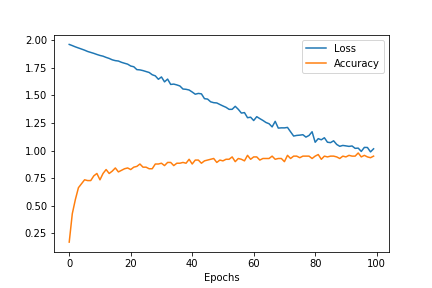

# GraphGallery


A gallery of state-of-the-arts graph neural networks. Implemented with Tensorflow 2.x.

This repo aims to achieve 4 goals:
+ Similar (or higher) performance with the corresponding papers
+ Faster implementation of training and testing
+ Simple and convenient to use, high scalability
+ Easy to read source codes

# Requirements

+ python>=3.6
+ tensorflow>=2.1 (2.1 is recommended)
+ networkx==2.3
+ scipy>=1.4.1
+ sklearn>=0.22
+ numpy>=1.18.1
+ numba>=0.48
+ gensim>=3.8.1

Extral packages (not necessary）:

+ metis==0.2a4
+ texttable

# Install
```bash
pip install -U graphgallery
```

# Quick Start
## Train a GCN model
```python
from graphgallery.nn.models import GCN
model = GCN(adj, x, labels, device='GPU', seed=123)
model.build()
his = model.train(idx_train, idx_val, verbose=1, epochs=100)
loss, accuracy = model.test(idx_test)
print(f'Test loss {loss:.5}, Test accuracy {accuracy:.2%}')
```
```
loss 1.02, acc 95.00%, val_loss 1.41, val_acc 77.40%: 100%|██████████| 100/100 [00:02<00:00, 37.07it/s]
Test loss 1.4123, Test accuracy 81.20%
```
## Visualization
```python
import matplotlib.pyplot as plt
plt.plot(his.history['loss'])
plt.plot(his.history['acc'])
plt.legend(['Loss', 'Accuracy'])
plt.xlabel('Epochs')
plt.savefig('visualization.png')
```



