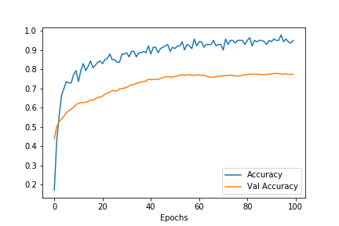
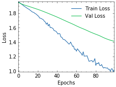

# GraphGallery


A gallery of state-of-the-arts graph neural networks. Implemented with Tensorflow 2.x.

This repo aims to achieve 4 goals:
+ Similar (or higher) performance
+ Faster training and testing
+ Simple and convenient to use, high scalability
+ Easy to read source codes

# Requirements

+ python>=3.6
+ tensorflow>=2.1 (2.1 is recommended)
+ networkx==2.3
+ scipy>=1.4.1
+ sklearn>=0.22
+ numpy>=1.18.1
+ numba>=0.48
+ gensim>=3.8.1

Other packages (not necessary）:

+ metis==0.2a4 (used for `ClusterGCN`)
+ texttable

# Install
```bash
pip install -U graphgallery
```
# Implementation
General models
+ **GCN** from *Semi-Supervised Classification with Graph Convolutional Networks* [🌐Paper](https://arxiv.org/abs/1609.02907)
+ **GAT** from *Graph Attention Networks* [🌐Paper](https://arxiv.org/abs/1710.10903>)
+ **SGC** from *Simplifying Graph Convolutional Networks* [🌐Paper](https://arxiv.org/abs/1902.07153)
+ **GraphSAGE** from *Inductive Representation Learning on Large Graphs* [🌐Paper](https://arxiv.org/abs/1706.02216)
+ **GWNN** from *Graph Wavelet Neural Network* [🌐Paper](https://arxiv.org/abs/1904.07785)
+ **GMNN** from *Graph Markov Neural Networks* [🌐Paper](https://arxiv.org/abs/1905.06214>)
+ **ChebyNet** from *Convolutional Neural Networks on Graphs with Fast Localized Spectral Filtering* [🌐Paper](https://arxiv.org/abs/1606.09375>)
+ **ClusterGCN** from *Cluster-GCN: An Efficient Algorithm for Training Deep and Large Graph Convolutional Networks* [🌐Paper](https://arxiv.org/abs/1905.07953)
+ **FastGCN** from *FastGCN: Fast Learning with Graph Convolutional Networks via Importance Sampling* [🌐Paper](https://arxiv.org/abs/1801.10247)
+ **LGCN** from  *Large-Scale Learnable Graph Convolutional Networks* [🌐Paper](https://arxiv.org/abs/1808.03965)

Defense models
+ **RGCN** from *Robust Graph Convolutional Networks Against Adversarial Attacks* [🌐Paper](https://dl.acm.org/doi/10.1145/3292500.3330851)
+ **SBVAT/OBVAT** from *Batch Virtual Adversarial Training for Graph Convolutional Networks* [🌐Paper](https://arxiv.org/abs/1902.09192)

Other models
+ **GCN_MIX**: Mixture of GCN and MLP
+ **GCNF**: GCN + feature
+ **DenseGCN**: Dense version of GCN
+ **EdgeGCN**: GCN using message passing framework
+ **MedianSAGE**: GraphSAGE using `Median` aggregation

# Quick Start
## Train a GCN model
```python
from graphgallery.nn.models import GCN
# adj is scipy sparse matrix, x is numpy array matrix
model = GCN(adj, x, labels, device='GPU', seed=123)
# build your GCN model with custom hyper-parameters
model.build()
# train your model. here idx_train and idx_val are numpy arrays
his = model.train(idx_train, idx_val, verbose=1, epochs=100)
# test your model
loss, accuracy = model.test(idx_test)
print(f'Test loss {loss:.5}, Test accuracy {accuracy:.2%}')
```
On `Cora` dataset:
```
loss 1.02, acc 95.00%, val_loss 1.41, val_acc 77.40%: 100%|██████████| 100/100 [00:02<00:00, 37.07it/s]
Test loss 1.4123, Test accuracy 81.20%
```
## Visualization
+ Accuracy
```python
import matplotlib.pyplot as plt
plt.plot(his.history['acc'])
plt.plot(his.history['val_acc'])
plt.legend(['Accuracy', 'Val Accuracy'])
plt.xlabel('Epochs')
```


+ Loss
```python
import matplotlib.pyplot as plt
plt.plot(his.history['loss'])
plt.plot(his.history['val_loss'])
plt.legend(['Loss', 'Val Loss'])
plt.xlabel('Epochs')
```



