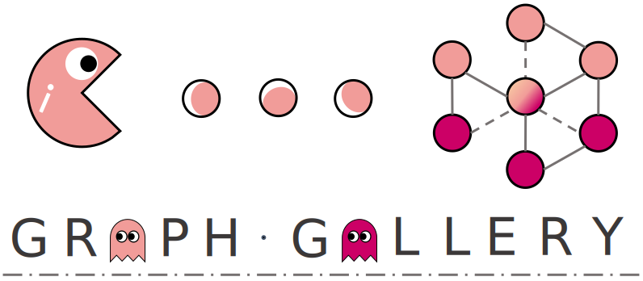

:github_url: https://github.com/EdisonLeeeee/GraphGallery

Welcome to GraphGallery's documentation!
=========================================

GraphGallery is a gallery for benchmarking Graph Neural Networks (GNNs) and Graph Adversarial Learning with 
`TensorFlow 2.x <https://github.com/tensorflow/tensorflow>`__ and `PyTorch <https://github.com/pytorch/pytorch>`__ backend. Besides, `Pytorch Geometric (PyG) <https://github.com/pyg-team/pytorch_geometric>`__ backend and `Deep Graph Library (DGL) <https://www.dgl.ai/>`__ backend now are available in GraphGallery.

.. toctree::
   :glob:
   :maxdepth: 1
   :caption: Installation 

   notes/installation

Package API
===========
.. toctree::
   :glob:
   :maxdepth: 1
   :caption: Package Reference

   modules/utils

Indices and Tables
==================

* :ref:`genindex`
* :ref:`modindex`

